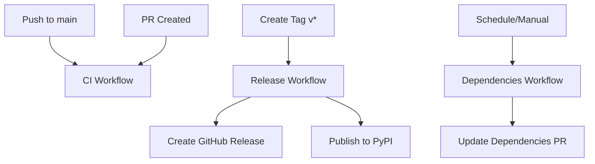

# GitHub Actions Workflows

This directory contains GitHub Actions workflows for automated CI/CD, testing, and publishing.

## Workflows Overview

### 🔄 CI (Continuous Integration) - `ci.yml`

**Triggers:** Push to main branches, pull requests, manual dispatch

**Jobs:**

- **Test**: Runs comprehensive tests across multiple Python versions (3.12, 3.13) and operating systems (Ubuntu, Windows, macOS)
- **Lint**: Code quality checks using ruff and mypy
- **Security**: Security scanning with bandit
- **Build Test**: Validates package building and installation
- **Coverage**: Generates and uploads test coverage reports

**Key Features:**

- Cross-platform testing
- Code quality enforcement
- Security vulnerability scanning
- Coverage reporting with Codecov integration

### 🚀 Release - `release.yml`

**Triggers:** Git tags matching `v*.*.*` pattern

**Jobs:**

- **Create Release**: Automatically creates GitHub releases with changelog
- **Publish**: Builds and publishes to PyPI after tests pass

**Key Features:**

- Automatic release creation from git tags
- Changelog extraction for release notes
- PyPI publishing with trusted publishing (OIDC)
- Release asset uploads

### 📦 Publish - `publish.yml`

**Triggers:** Tags, releases, manual dispatch

**Jobs:**

- **Test**: Full test suite validation
- **Build**: Package building and validation
- **TestPyPI**: Publishes to TestPyPI for testing
- **PyPI**: Publishes to production PyPI
- **Changelog Update**: Updates changelog post-release

**Key Features:**

- Dual-stage publishing (TestPyPI → PyPI)
- Comprehensive pre-publish validation
- Trusted publishing without API tokens
- Automatic changelog maintenance

### 📋 Dependencies - `dependencies.yml`

**Triggers:** Weekly schedule (Mondays at 9 AM UTC), manual dispatch

**Jobs:**

- **Update Dependencies**: Checks for and updates dependency versions
- **Security Audit**: Performs security audits on dependencies

**Key Features:**

- Automated dependency updates via pull requests
- Security vulnerability detection
- Automated testing of updated dependencies

## Usage Guidelines

### 🏷️ Creating a Release

1. **Update Version**: Ensure version in `pyproject.toml` matches your intended release
2. **Update Changelog**: Add release notes to `CHANGELOG.md` under `## v{version}` header
3. **Create Tag**:
   ```bash
   git tag v1.2.3
   git push origin v1.2.3
   ```
4. **Automatic Process**: The `release.yml` workflow will automatically:
   - Create a GitHub release
   - Extract changelog for release notes
   - Build and test the package
   - Publish to PyPI

### 🔧 Development Workflow

1. **Feature Development**: Create feature branches from `main`
2. **Pull Requests**: CI workflow runs automatically on PR creation
3. **Code Quality**: All linting, formatting, and type checks must pass
4. **Testing**: Tests must pass across all supported platforms
5. **Security**: Security scans must not reveal critical vulnerabilities

### ⚙️ Configuration

#### Repository Secrets Required

None! This setup uses GitHub's trusted publishing feature for PyPI, which uses OIDC tokens instead of API keys.

#### Repository Settings

1. **Environments**: Create environments in GitHub repository settings:

   - `pypi`: For production PyPI publishing
   - `testpypi`: For TestPyPI publishing (optional)

2. **Branch Protection**: Recommended rules for `main` branch:
   - Require pull request reviews
   - Require status checks to pass (CI workflow)
   - Require up-to-date branches

#### PyPI Trusted Publishing Setup

1. Go to PyPI account settings → Publishing → Add new pending publisher
2. Fill in:
   - **Owner**: Your GitHub username/organization
   - **Repository**: Repository name
   - **Workflow name**: `release.yml`
   - **Environment name**: `pypi`

### 📊 Monitoring

- **CI Status**: Check Actions tab for build status
- **Coverage**: View coverage reports in Codecov (if configured)
- **Security**: Review security scan artifacts in workflow runs
- **Dependencies**: Monitor dependency update PRs

### 🛠️ Customization

#### Adding New Tests

Add test files to the `tests/` directory following pytest conventions. The CI workflow will automatically discover and run them.

#### Modifying Build Process

Edit the build steps in workflows if you need custom build processes, additional validation steps, or different publishing targets.

#### Changing Schedule

Modify the `cron` expression in `dependencies.yml` to change when dependency updates run.

## Workflow Dependencies



## Best Practices

1. **Version Management**: Always update version in `pyproject.toml` before tagging
2. **Changelog**: Keep `CHANGELOG.md` updated with meaningful release notes
3. **Testing**: Write comprehensive tests for new features
4. **Security**: Regularly review security audit reports
5. **Dependencies**: Review and test dependency update PRs promptly

## Troubleshooting

### Common Issues

1. **Build Fails**: Check test failures in CI workflow logs
2. **Publishing Fails**: Verify PyPI trusted publishing configuration
3. **Coverage Drops**: Add tests for new code to maintain coverage
4. **Security Alerts**: Address flagged vulnerabilities in dependencies

### Getting Help

- Check workflow logs in the Actions tab
- Review the specific job that failed
- Look for error messages in the step outputs
- Verify repository settings and environment configuration
