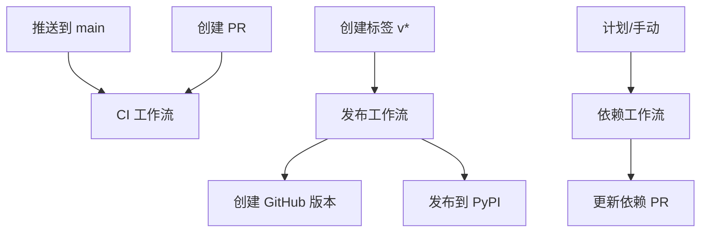

# GitHub Actions 工作流

本目录包含用于自动化 CI/CD、测试和发布的 GitHub Actions 工作流。

## 工作流概览

### 🔄 CI (持续集成) - `ci.yml`

**触发条件：** 推送到主分支、拉取请求、手动触发

**任务：**

- **跨平台测试 (cross-platform-tests)**: 在多个 Python 版本 (3.12, 3.13) 和操作系统 (Ubuntu, Windows, macOS) 上运行综合测试
- **代码质量检查 (code-quality-checks)**: 使用 ruff 和 mypy 进行代码质量检查
- **安全扫描 (security-scan)**: 使用 bandit 进行安全扫描
- **包构建验证 (package-build-validation)**: 验证包构建和安装
- **测试覆盖率报告 (test-coverage-report)**: 生成并上传测试覆盖率报告

**主要特性：**

- 跨平台测试
- 代码质量强制执行
- 安全漏洞扫描
- 与 Codecov 集成的覆盖率报告

### 🚀 发布 - `release.yml`

**触发条件：** 匹配 `v*.*.*` 模式的 Git 标签

**任务：**

- **GitHub Release 创建 (github-release-creation)**: 自动创建带有更新日志的 GitHub 版本
- **PyPI 包发布 (pypi-package-publication)**: 测试通过后构建并发布到 PyPI

**主要特性：**

- 从 git 标签自动创建版本
- 为版本说明提取更新日志
- 使用可信发布 (OIDC) 发布到 PyPI
- 版本资源上传

### 📦 发布 - `publish.yml`

**触发条件：** 标签、版本、手动触发

**任务：**

- **发布前验证 (pre-publish-validation)**: 完整的测试套件验证
- **分发包构建 (distribution-package-build)**: 包构建和验证
- **TestPyPI 发布 (testpypi-publication)**: 发布到 TestPyPI 进行测试
- **生产环境 PyPI 发布 (pypi-production-publication)**: 发布到生产环境 PyPI
- **更新日志更新 (changelog-update)**: 发布后更新更新日志

**主要特性：**

- 双阶段发布 (TestPyPI → PyPI)
- 全面的发布前验证
- 无需 API 令牌的可信发布
- 自动更新日志维护

### 📋 依赖管理 - `dependencies.yml`

**触发条件：** 每周计划 (周一上午 9 点 UTC)、手动触发

**任务：**

- **自动依赖更新 (automated-dependency-update)**: 检查并更新依赖版本
- **漏洞安全审计 (vulnerability-security-audit)**: 对依赖项执行安全审计

**主要特性：**

- 通过拉取请求自动更新依赖
- 安全漏洞检测
- 更新依赖的自动化测试

## 使用指南

### 🏷️ 创建版本

1. **更新版本**: 确保 `pyproject.toml` 中的版本与您预期的版本匹配
2. **更新更新日志**: 在 `CHANGELOG.md` 中 `## v{version}` 标题下添加版本说明
3. **创建标签**:
   ```bash
   git tag v1.2.3
   git push origin v1.2.3
   ```
4. **自动流程**: `release.yml` 工作流将自动：
   - 创建 GitHub 版本
   - 为版本说明提取更新日志
   - 构建和测试包
   - 发布到 PyPI

### 🔧 开发工作流

1. **功能开发**: 从 `main` 创建功能分支
2. **拉取请求**: 创建 PR 时自动运行 CI 工作流
3. **代码质量**: 所有代码检查、格式化和类型检查必须通过
4. **测试**: 测试必须在所有支持的平台上通过
5. **安全**: 安全扫描不得显示关键漏洞

### ⚙️ 配置

#### 需要的仓库密钥

无需！此设置使用 GitHub 的可信发布功能进行 PyPI 发布，使用 OIDC 令牌代替 API 密钥。

#### 仓库设置

1. **环境**: 在 GitHub 仓库设置中创建环境：

   - `pypi`: 用于生产环境 PyPI 发布
   - `testpypi`: 用于 TestPyPI 发布 (可选)

2. **分支保护**: `main` 分支的推荐规则：
   - 要求拉取请求审查
   - 要求状态检查通过 (CI 工作流)
   - 要求最新分支

#### PyPI 可信发布设置

1. 转到 PyPI 账户设置 → 发布 → 添加新的待发布者
2. 填写：
   - **所有者**: 您的 GitHub 用户名/组织
   - **仓库**: 仓库名称
   - **工作流名称**: `release.yml`
   - **环境名称**: `pypi`

### 📊 监控

- **CI 状态**: 检查 Actions 选项卡的构建状态
- **覆盖率**: 在 Codecov 中查看覆盖率报告 (如果已配置)
- **安全**: 在工作流运行中查看安全扫描产物
- **依赖**: 监控依赖更新 PR

### 🛠️ 自定义

#### 添加新测试

将测试文件添加到 `tests/` 目录，遵循 pytest 约定。CI 工作流将自动发现并运行它们。

#### 修改构建过程

如果需要自定义构建过程、额外的验证步骤或不同的发布目标，请编辑工作流中的构建步骤。

#### 更改计划

修改 `dependencies.yml` 中的 `cron` 表达式以更改依赖更新运行的时间。

## 工作流依赖关系



## 最佳实践

1. **版本管理**: 在标记之前始终更新 `pyproject.toml` 中的版本
2. **更新日志**: 保持 `CHANGELOG.md` 更新，包含有意义的版本说明
3. **测试**: 为新功能编写全面的测试
4. **安全**: 定期审查安全审计报告
5. **依赖**: 及时审查和测试依赖更新 PR

## 故障排除

### 常见问题

1. **构建失败**: 检查 CI 工作流日志中的测试失败
2. **发布失败**: 验证 PyPI 可信发布配置
3. **覆盖率下降**: 为新代码添加测试以维持覆盖率
4. **安全警报**: 处理依赖项中标记的漏洞

### 获取帮助

- 在 Actions 选项卡中检查工作流日志
- 审查失败的具体任务
- 查看步骤输出中的错误消息
- 验证仓库设置和环境配置
