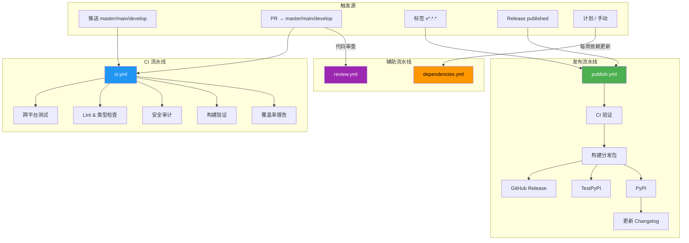

## 架构概览

```mermaid
graph TD
    subgraph "触发源"
        A["推送 master/main/develop"]
        B0["PR → master/main/develop"]
        C["标签 v*.*.*"]
        C2["Release published"]
        G["计划 / 手动"]
    end

    subgraph "CI 流水线"
        B[ci.yml]
        B1[跨平台测试]
        B2[Lint & 类型检查]
        B3[安全审计]
        B4[构建验证]
        B5[覆盖率报告]
        B --> B1 & B2 & B3 & B4 & B5
    end

    subgraph "发布流水线"
        D[publish.yml]
        D0[CI 验证]
        D1[构建分发包]
        D2[GitHub Release]
        D3[TestPyPI]
        D4[PyPI]
        D5[更新 Changelog]
        D --> D0 --> D1
        D1 --> D2
        D1 --> D3
        D1 --> D4 --> D5
    end

    subgraph "辅助流水线"
        H[dependencies.yml]
        K[review.yml]
    end

    A --> B
    B0 --> B
    C --> D
    C2 --> D
    G -->|"每周依赖更新"| H
    B0 -->|"代码审查"| K

    style B fill:#2196F3,color:#fff
    style D fill:#4CAF50,color:#fff
    style H fill:#FF9800,color:#000
    style K fill:#9C27B0,color:#fff
```

## 工作流详解

### 🔄 CI — [`ci.yml`](../.github/workflows/ci.yml)

**触发条件：** 推送到 master/main/develop、PR → master/main/develop、`workflow_call`、手动触发

| Job | 职责 |
|-----|------|
| `test` | 在 Ubuntu / Windows / macOS 上运行 pytest |
| `lint` | ruff lint + format check + mypy 类型检查 |
| `security` | bandit 静态安全扫描 + pip-audit 依赖漏洞扫描 |
| `build` | 构建 wheel 并验证安装 |
| `coverage` | 覆盖率报告 + Codecov 上传 |

支持 `workflow_call`，可被 publish.yml 作为验证步骤调用。

### 🚀 发布 — [`publish.yml`](../.github/workflows/publish.yml)

**触发条件：** `v*.*.*` 标签推送、Release published、手动触发（需指定 version）

| Job | 职责 | 触发条件 |
|-----|------|----------|
| `validate` | 调用 ci.yml 执行完整验证 | 始终 |
| `build` | 构建分发包 + twine check | 始终 |
| `github-release` | 从 CHANGELOG 提取 notes，创建 Release | 标签推送 |
| `testpypi` | 发布到 TestPyPI | 标签推送 / 手动 |
| `pypi` | 发布到 PyPI（OIDC 可信发布） | Release published |
| `changelog-update` | 发布后更新 CHANGELOG | Release published |

### 📋 依赖管理 — [`dependencies.yml`](../.github/workflows/dependencies.yml)

**触发条件：** 每周一 9:00 UTC、手动触发

| Job | 职责 |
|-----|------|
| `update` | `uv lock --upgrade` → 测试 → 创建 PR |

### 🤖 代码审查 — [`review.yml`](../.github/workflows/review.yml)

**触发条件：** PR opened/synchronize/reopened、推送到 master/main、手动触发

| Job | 职责 |
|-----|------|
| `pr-review` | 审查 PR 变更文件，发布 PR 评论 |
| `push-review` | 审查推送到主分支的变更，发布 commit 评论或告警摘要 |

**实现方式：**
- 基于官方 `anthropics/claude-code-action@v1`
- PR 审查启用 `track_progress` 与 sticky comment
- 审查异常采用“告警但不中断”策略，避免辅助流程将主交付链路打红

## 可复用组件

### Composite Action: [`setup-python-uv`](../.github/actions/setup-python-uv/action.yml)

所有工作流共享的 Python 环境初始化 action。

| 参数 | 默认值 | 说明 |
|------|--------|------|
| `python-version` | `3.13` | Python 版本 |
| `install-dev` | `true` | 是否安装开发依赖 |
| `enable-cache` | `true` | 是否启用 uv 缓存 |

## 环境配置

> 版本创建与发布操作步骤详见 [开发指南 > 发布流程](./2-Development.md#发布流程)。

**仓库密钥：**

| Secret | 用途 | 必需 |
|--------|------|------|
| `ANTHROPIC_API_KEY` | 代码审查 | 仅 review.yml |
| `ANTHROPIC_BASE_URL` | API 端点 | 可选 |

**关键 Action 版本：**

- `actions/checkout@v6`
- `actions/setup-node@v6`（如后续 workflow 需要 Node 环境）
- `actions/github-script@v8`（如后续 workflow 需要 GitHub Script）
- `peter-evans/create-pull-request@v8`
- `anthropics/claude-code-action@v1`

**PyPI 可信发布：**

1. PyPI 账户 → 发布 → 添加待发布者
2. 填写：所有者、仓库名、工作流 `publish.yml`、环境 `pypi`

**GitHub 环境：**

- `pypi` — 生产环境 PyPI 发布
- `testpypi` — TestPyPI 发布（可选）

## 故障排除

| 问题 | 解决方案 |
|------|---------|
| 构建失败 | 检查 CI 日志中的测试/lint 失败 |
| 发布失败 | 验证 PyPI 可信发布配置与环境设置 |
| 依赖 PR 创建失败 | 检查 Actions 权限（Settings → Actions → Workflow permissions） |
| 代码审查未执行 | 验证 `ANTHROPIC_API_KEY` 已配置 |
| 代码审查告警但未阻塞 | 查看 `review.yml` 中 Claude 步骤日志，通常是模型限流、超时或外部服务异常 |
| 覆盖率下降 | 为新代码添加测试 |
