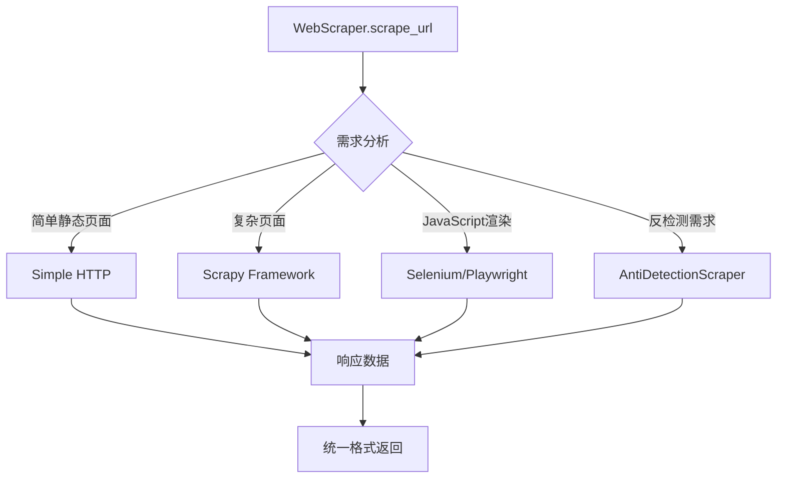
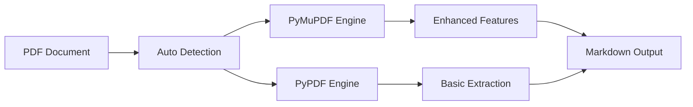
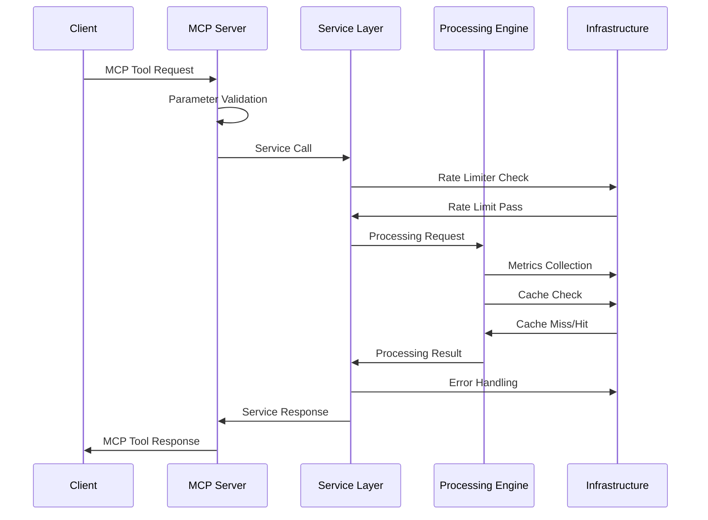
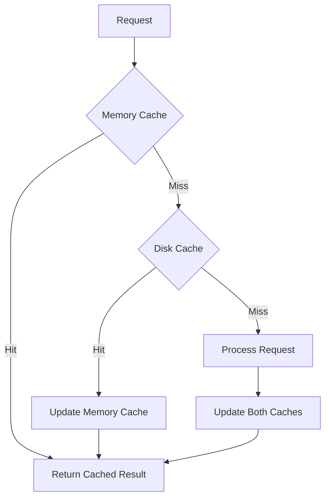

# Data Extractor 工程架构设计框架

## 概述

Data Extractor 是一个基于 FastMCP 框架构建的企业级数据提取与转换 MCP Server，采用分层架构设计，集成了多种网页抓取技术、PDF 处理引擎和 Markdown 转换工具。本文档详细阐述项目的工程架构设计方案、技术选型、模块组织和核心设计模式。

## 总体架构

### 架构原则

- **分层解耦**：采用清晰的分层架构，各层职责明确，降低模块间耦合度
- **可扩展性**：基于插件化设计，支持多种抓取方法和处理引擎
- **高可用性**：内置重试机制、错误处理和性能监控
- **企业级特性**：支持速率限制、缓存管理、代理轮换和指标收集

### 核心架构层次

```
┌─────────────────────────────────────────────────────────────┐
│                    FastMCP Server Layer                     │
│                 (14 MCP Tools via @app.tool)                │
├─────────────────────────────────────────────────────────────┤
│                   Business Logic Layer                      │
│              (Service Classes & Orchestration)              │
├─────────────────────────────────────────────────────────────┤
│                  Data Processing Layer                      │
│           (Scraping, PDF, Markdown Conversion)              │
├─────────────────────────────────────────────────────────────┤
│                  Infrastructure Layer                       │
│        (Rate Limiter, Cache, Metrics, Error Handler)        │
├─────────────────────────────────────────────────────────────┤
│                  Configuration Layer                        │
│              (Settings, Environment Variables)              │
└─────────────────────────────────────────────────────────────┘
```

## 核心模块架构

### 1. FastMCP 服务器层 (`extractor/server.py`)

**设计模式**：微服务架构 + 装饰器模式

**核心职责**：

- 提供 14 个 MCP 工具接口，使用 `@app.tool()` 装饰器注册
- 统一的请求验证和响应格式化
- 错误处理和指标收集集成
- 异步任务协调和生命周期管理

**关键设计决策**：

```python
# 延迟初始化 PDF 处理器避免启动时加载 PyMuPDF
def _get_pdf_processor(enable_enhanced_features: bool = True):
    from .pdf_processor import PDFProcessor
    return PDFProcessor(enable_enhanced_features=enable_enhanced_features)
```

### 2. 网页抓取引擎 (`extractor/scraper.py`)

**设计模式**：策略模式 + 工厂模式

**多策略抓取架构**：



**方法自动选择算法**：

- 基于 JavaScript 检测和反爬虫保护需求
- 考虑性能要求和资源消耗
- 支持手动方法覆盖

### 3. 高级功能模块 (`extractor/advanced_features.py`)

**设计模式**：代理模式 + 策略模式

**反检测能力**：

- **undetected-chromedriver**：绕过 Chrome 自动化检测
- **Playwright 隐身**：使用现代浏览器自动化技术
- **用户代理轮换**：动态模拟真实用户行为
- **行为模拟**：鼠标移动、滚动和点击延迟

**表单自动化**：

```python
class FormHandler:
    async def fill_and_submit_form(self, url, form_data, submit_button_selector):
        # 支持多种表单元素类型
        # 智能等待元素加载
        # 自动处理验证码和挑战
```

### 4. PDF 处理引擎 (`extractor/pdf_processor.py`)

**设计模式**：适配器模式 + 延迟加载

**双引擎架构**：



**增强功能特性**：

- **图像提取**：从 PDF 页面提取并嵌入到 Markdown
- **表格识别**：智能转换 PDF 表格为 Markdown 表格
- **数学公式提取**：保持 LaTeX 格式的完整性
- **结构化输出**：包含元数据和资源链接

### 5. Markdown 转换器 (`extractor/markdown_converter.py`)

**设计模式**：适配器模式 + 策略模式

**Microsoft MarkItDown 集成**：

```python
class MarkdownConverter:
    def __init__(self, enable_plugins=False, llm_client=None):
        self.markitdown = MarkItDown(llm_client=llm_client)
```

**高级转换功能**：

- **智能内容提取**：自动识别主要内容区域
- **图片嵌入**：支持 data URI 格式的远程图片嵌入
- **格式优化**：表格对齐、代码语言检测、智能排版
- **批量处理**：并发处理多个文档

### 6. 配置系统 (`extractor/config.py`)

**设计模式**：设置模式 + 环境变量映射

**动态配置架构**：

```python
class DataExtractorSettings(BaseSettings):
    # 使用 DATA_EXTRACTOR_ 前缀自动环境变量映射
    concurrent_requests: int = Field(default=16, gt=0)
    rate_limit_requests_per_minute: int = Field(default=60, ge=1)

    def _get_dynamic_version():
        # 从 pyproject.toml 动态读取版本号
```

**配置分层**：

- **默认配置**：代码中定义的默认值
- **环境变量**：`DATA_EXTRACTOR_` 前缀的环境变量
- **运行时配置**：通过参数传递的动态配置

### 7. 企业级工具集 (`extractor/utils.py`)

**设计模式**：装饰器模式 + 观察者模式

**核心工具组件**：

| 工具类             | 功能特性     | 设计模式   |
| ------------------ | ------------ | ---------- |
| `RateLimiter`      | 请求频率控制 | 令牌桶算法 |
| `RetryManager`     | 智能重试机制 | 指数退避   |
| `CacheManager`     | TTL 缓存管理 | LRU 淘汰   |
| `MetricsCollector` | 性能指标收集 | 观察者模式 |
| `ErrorHandler`     | 分层错误处理 | 策略模式   |

## 数据流架构

### 请求处理流程



### 错误处理架构

**分层错误处理策略**：

1. **网络层错误**：连接超时、DNS 解析失败
2. **协议层错误**：HTTP 状态码、响应格式错误
3. **业务层错误**：数据提取失败、转换异常
4. **系统层错误**：资源不足、依赖服务不可用

**错误分类与重试策略**：

```python
class ErrorHandler:
    ERROR_CATEGORIES = {
        'timeout': {'max_retries': 3, 'backoff_factor': 2},
        'connection': {'max_retries': 2, 'backoff_factor': 1.5},
        'rate_limit': {'max_retries': 5, 'backoff_factor': 3},
        'server_error': {'max_retries': 4, 'backoff_factor': 2}
    }
```

## 性能与可扩展性设计

### 异步架构

- **事件驱动**：基于 asyncio 的事件循环
- **并发控制**：可配置的并发请求数量
- **资源池化**：浏览器实例和连接池管理
- **流式处理**：大批量数据的分块处理

### 缓存策略

**多级缓存架构**：



### 指标监控系统

**关键性能指标 (KPIs)**：

- **吞吐量**：每秒处理的请求数 (RPS)
- **延迟**：P50, P95, P99 响应时间
- **成功率**：请求成功率分布
- **资源利用率**：CPU、内存、网络使用率

## 安全性设计

### 反检测机制

**技术栈**：

- **浏览器隐身**：undetected-chromedriver, Playwright
- **行为模拟**：随机延迟、鼠标轨迹、键盘输入
- **指纹规避**：User-Agent 轮换、Canvas 指纹处理
- **代理支持**：HTTP/HTTPS/SOCKS 代理轮换

### 数据安全

**敏感数据处理**：

- **凭据管理**：环境变量存储，避免硬编码
- **数据清理**：自动清理临时文件和缓存
- **日志脱敏**：敏感信息不记录到日志
- **传输加密**：HTTPS 强制，证书验证

## 部署架构

### 容器化部署

```dockerfile
# 多阶段构建优化镜像大小
FROM python:3.12-slim as base
# 安装系统依赖
FROM base as runtime
# 复制应用代码
# 配置环境变量
# 暴露 MCP 服务端口
```

### 环境配置

**生产环境建议配置**：

```yaml
# Kubernetes Deployment 示例
apiVersion: apps/v1
kind: Deployment
metadata:
  name: data-extractor
spec:
  replicas: 3
  selector:
    matchLabels:
      app: data-extractor
  template:
    spec:
      containers:
        - name: data-extractor
          image: data-extractor:latest
          resources:
            limits:
              memory: "2Gi"
              cpu: "1000m"
          env:
            - name: DATA_EXTRACTOR_CONCURRENT_REQUESTS
              value: "32"
            - name: DATA_EXTRACTOR_RATE_LIMIT_REQUESTS_PER_MINUTE
              value: "120"
```

## 测试架构

### 测试金字塔

```
                    ┌─────────────────┐
                    │  E2E Tests (5)  │
                    └─────────────────┘
                ┌─────────────────────────┐
                │   Integration (25)     │
                └─────────────────────────┘
            ┌─────────────────────────────────┐
            │       Unit Tests (70%)          │
            └─────────────────────────────────┘
```

**测试覆盖范围**：

- **单元测试**：各模块的独立功能测试
- **集成测试**：模块间交互和数据流测试
- **端到端测试**：完整业务场景的自动化测试
- **性能测试**：负载测试和压力测试

### 质量保障

**代码质量控制**：

- **静态分析**：Ruff 代码检查与自动格式化，MyPy 类型检查
- **测试覆盖率**：pytest-cov 覆盖率报告
- **CI/CD 流水线**：GitHub Actions 自动化测试

## 未来扩展方向

### 水平扩展

- **分布式抓取**：多节点协同抓取
- **消息队列**：Redis/RabbitMQ 任务队列
- **负载均衡**：Nginx/HAProxy 请求分发
- **数据库集成**：PostgreSQL/MongoDB 结果存储

### 功能增强

- **AI 集成**：大语言模型内容理解
- **多媒体处理**：图片、音频、视频内容提取
- **实时流处理**：WebSocket 实时数据推送
- **可视化界面**：Web UI 和监控仪表板

## 技术债务与优化

### 当前限制

- **浏览器资源消耗**：Selenium 实例内存占用较高
- **JavaScript 执行效率**：动态内容抓取性能瓶颈
- **PDF 处理速度**：大文件处理时间较长
- **并发控制精度**：细粒度限流需要改进

### 优化计划

- **浏览器池化**：预创建和复用浏览器实例
- **智能缓存**：基于内容相似度的缓存策略
- **流式处理**：大文件的分块并行处理
- **算法优化**：选择器匹配和数据提取算法改进

---

本架构文档将随着项目的发展持续更新，确保技术选型与设计决策的时效性和准确性。
